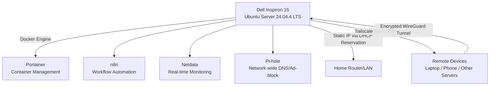

# 🖥️ Dell Inspiron Homelab

Turning a retired Dell Inspiron 15 laptop into an always-on, self-hosted home server running Docker-based services for automation, monitoring, and network-wide ad blocking — accessible securely from anywhere via a private mesh VPN.

---

## 📖 Table of Contents

- [Overview](#-overview)
- [Architecture](#-architecture)
- [Hardware & OS](#-hardware--os)
- [Services](#-services)
- [Network & Security](#-network--security)
- [Screenshots](#-screenshots)
- [Setup Guide](#-setup-guide)
- [Lessons Learned](#-lessons-learned)
- [Roadmap](#-roadmap)

---

## 🎯 Overview

Instead of letting an old laptop collect dust, I repurposed it into a headless Ubuntu Server that now runs 24/7 as a home automation and network utility hub. The goal was to get hands-on experience with:

- Linux server administration (headless, SSH-only)
- Docker container orchestration
- Self-hosted network monitoring and DNS filtering
- Workflow automation
- Secure remote access without exposing ports to the public internet

Everything is managed centrally through **Portainer**, monitored in real time through **Netdata**, and reachable from any of my devices worldwide through a **Tailscale** mesh VPN — no port forwarding, no public-facing attack surface.

---

## 🏗️ Architecture

The server sits on the local network with a **static LAN IP via router DHCP reservation**, and is remotely reachable through **Tailscale**, which creates an encrypted point-to-point mesh network between all my personal devices — meaning I can manage the server, view dashboards, and SSH in from anywhere without opening a single port on my router.

---

## 💻 Hardware & OS

| Component | Spec |
|---|---|
| Device | Dell Inspiron 15 (repurposed laptop) |
| OS | Ubuntu Server 24.04.4 LTS |
| Kernel | 6.8.0-124-generic |
| RAM | 19 GB |
| Storage | 98 GB (~20% used) |
| Access | Headless — SSH only, lid closed, running as a dedicated appliance |
| Uptime target | 24/7 |

---

## 🧩 Services

All services run as Docker containers, managed through Portainer.

| Service | Purpose | Port | Status |
|---|---|---|---|
| **Portainer** | Web UI for managing Docker containers, images, and stacks | `9000` | ✅ Running |
| **n8n** | Self-hosted workflow automation / AI agent orchestration | `5678` | ✅ Running |
| **Netdata** | Real-time system & container performance monitoring | `19999` | ✅ Healthy |
| **Pi-hole** | Network-wide DNS sinkhole / ad & tracker blocking | `53` (DNS) | ✅ Healthy |

**Current stats (example snapshot):**
- Pi-hole blocking ~30% of all DNS queries network-wide across 13 active clients
- Netdata tracking CPU, RAM, network, and per-container metrics live
- n8n set up for building automated workflows / AI agent pipelines

---

## 🔐 Network & Security

- **Static IP:** Assigned via router-level DHCP reservation (not manually configured in netplan), so the server always gets the same LAN address on boot.
- **Remote access:** [Tailscale](https://tailscale.com/) mesh VPN connects the server to all personal devices (laptops, phone) using WireGuard-based encrypted tunnels — no public ports exposed.
- **SSH:** Password/key-based login restricted to the Tailscale network and LAN; a warning banner (`AUTHORIZED ACCESS ONLY`) is shown on login.
- **DNS filtering:** Pi-hole acts as the primary DNS resolver for the whole home network, blocking ads and trackers at the network level.
- **Container isolation:** Each service runs in its own Docker network/container, managed and monitored centrally via Portainer.

---

## 📸 Screenshots

> Sensitive info (IP addresses, hostnames) redacted.

| Portainer — Container List | n8n — Workflow Dashboard |
|---|---|
| *(add screenshot)* | *(add screenshot)* |

| Netdata — System Metrics | Pi-hole — Query Dashboard |
|---|---|
| *(add screenshot)* | *(add screenshot)* |

| Tailscale — Connected Devices |
|---|
| *(add screenshot)* |

---

## ⚙️ Setup Guide

See [`docs/SETUP.md`](docs/SETUP.md) for the full step-by-step walkthrough, covering:
1. Flashing and installing Ubuntu Server on the old laptop
2. Reserving a static IP via router DHCP settings
3. Installing Docker & Docker Compose
4. Deploying Portainer as the management layer
5. Deploying n8n, Netdata, and Pi-hole as containers
6. Installing and joining the Tailscale network
7. Hardening SSH access

---

## 🐛 Lessons Learned

See [`docs/TROUBLESHOOTING.md`](docs/TROUBLESHOOTING.md) for real issues encountered along the way, including:
- Recurring `ACPI Error: Cannot release Mutex [PATM]` kernel log spam on this Dell hardware and how it was diagnosed as non-fatal firmware noise
- Notes on keeping a laptop running reliably as a headless "lid closed" server

---

## 🗺️ Roadmap

- [ ] Add Watchtower for automatic container updates
- [ ] Set up centralized log aggregation (e.g., Loki + Grafana)
- [ ] Add automated backups for container volumes
- [ ] Expand n8n workflows for home automation / notifications
- [ ] Document full `docker-compose.yml` stack (sanitized) for reproducibility

---

## 📄 License

This project documents a personal homelab setup for educational/portfolio purposes. Feel free to reference the architecture and setup approach for your own projects.
